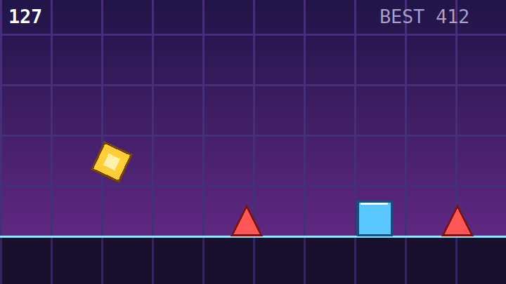

# Geometry Dash — M5Stack Cardputer

A small Geometry-Dash-style auto-runner for the [M5Stack Cardputer](https://docs.m5stack.com/en/core/Cardputer).
The cube runs forward on its own — you only control the jump. Dodge the spikes,
ride the blocks, survive as long as you can.


<p align="center">
  
</p>

> Preview rendered as SVG with the game's exact palette and geometry. Replace
> `docs/screenshot.svg` with a real photo of the device once you have one.

## Gameplay

- The cube auto-runs; the world scrolls toward it and speeds up over time.
- **Spikes** (red triangles) are lethal on any touch.
- **Blocks** (blue squares) can be landed on top of — but hitting one from the
  side kills you.
- A clean hitbox-friendly margin makes near-misses feel fair.
- Your best score, total attempts and lifetime score are persisted across
  reboots **and reflashes** — see [Persistent settings](#persistent-settings).

## Controls

| Action            | Input                                   |
|-------------------|-----------------------------------------|
| Jump              | Any key / `SPACE` (hold to keep jumping) |
| Jump (alt)        | Front button (`G0` / `BtnA`)             |
| Start / Retry     | Any key on the menu or game-over screen  |

## Build & flash from source

This is a [PlatformIO](https://platformio.org/) project.

```bash
# from the project root
pio run                 # compile
pio run -t upload       # compile + flash over USB-C
pio device monitor      # optional: serial log @ 115200
```

The `M5Cardputer` library (and its `M5Unified` / `M5GFX` dependencies) is pulled
in automatically via `lib_deps` in [platformio.ini](platformio.ini).

### Flashing a pre-built release

Each git tag (`vX.Y.Z`) produces a GitHub Release with two artifacts attached:

- `cardputer-geometriedash-vX.Y.Z-merged.bin` — bootloader + partition table +
  boot_app0 + app, all in one image. **Flash this one** to a stock Cardputer:
  ```bash
  esptool.py --chip esp32s3 --port /dev/cu.usbmodem1101 write_flash 0x0 \
      cardputer-geometriedash-vX.Y.Z-merged.bin
  ```
- `cardputer-geometriedash-vX.Y.Z.bin` — application image only, for users who
  already have a compatible bootloader/partition table and just want to flash
  the app at `0x10000`.

Releases are produced automatically by [.github/workflows/release.yml](.github/workflows/release.yml)
on tag push (see [Versioning & releases](#versioning--releases) below).

### Arduino IDE

Install the **M5Cardputer** library from the Library Manager, select the
**M5Stack-StampS3** board, and open [src/main.cpp](src/main.cpp) as a `.ino`
sketch (rename or copy it into a folder of the same name).

## Persistent settings

Best score and play history live in a plain text file on the device:

```
/cardputer-geometriedash-settings.txt
```

Format (key=value, one per line — comments start with `#`):

```
# Geometry Dash for Cardputer - persistent settings
version=0.1.0
best=412
attempts=37
lifetime_score=18432
```

The game tries two backends in order:

1. **SD card** (if inserted) — survives *any* reflash, including a full
   `esptool.py erase_flash`. The current backend is shown as `[SD]` in the
   bottom-right corner of the title screen.
2. **Internal LittleFS** — survives a normal `pio run -t upload` but is wiped
   by `erase_flash`. Shown as `[FS]`.

A best score saved by an older build using NVS (`Preferences`) is migrated
automatically on first boot of the new version, so existing players don't
lose their record.

To back up or transfer your history: pop the SD card and copy the file off it,
or keep playing from the same card on a freshly flashed device.

## Versioning & releases

The single source of truth is the [VERSION](VERSION) file. The PlatformIO
pre-build hook ([scripts/version.py](scripts/version.py)) injects its value as
a `GD_VERSION` macro so the firmware can display its own version on the title
screen.

Cutting a release:

```bash
scripts/bump-version.sh patch     # 0.1.0 -> 0.1.1  (also: minor / major)
git push origin main --tags       # triggers the release workflow
```

The [release workflow](.github/workflows/release.yml) checks out the tag,
installs PlatformIO, runs `scripts/package.sh`, and attaches the resulting
`dist/*.bin` to a GitHub Release with auto-generated notes.

To produce the same artifacts locally:

```bash
scripts/package.sh
ls dist/
# cardputer-geometriedash-v0.1.0.bin
# cardputer-geometriedash-v0.1.0-merged.bin
```

## How it works

Everything lives in [src/main.cpp](src/main.cpp), one translation unit:

- **Rendering** is double-buffered through an `M5Canvas` sprite (240×135, 16-bit)
  pushed once per frame — no flicker.
- **Physics** is a fixed-step loop paced to ~60 FPS: constant gravity, a single
  jump impulse, and the cube spinning in the air then snapping to a clean face
  on landing.
- **Obstacles** are spawned procedurally as small "patterns" (spike rows, low or
  tall blocks, ride-across platforms, block-then-spike combos) with gaps tuned
  so every pattern is clearable with one jump.
- **Collision** uses slightly inset axis-aligned boxes; blocks resolve as
  landings when approached from above, and as death when hit from the side.

## Tuning

The constants at the top of [src/main.cpp](src/main.cpp) are the knobs:
`GRAVITY`, `JUMP_VEL`, `SPEED_MIN` / `SPEED_MAX`, `ROT_SPEED`, and the obstacle
sizes. Adjust to taste.

## License

[MIT](LICENSE) — © 2026 Benoit Lamouche
